# Kaiburr Task 2 – Kubernetes Deployment of Java REST API

## Author
**Name:** Suruthi M S  
**GitHub:** https://github.com/Suruthinathan  
**Email:** suruthi1425@gmail.com

## **Table of Contents**
1. [Author](#author)
2. [Overview](#overview)
3. [Repository Structure](#repository-structure)
4. [Prerequisites](#prerequisites)
5. [Step 1 – Build Java Application](#step-1-–-build-java-application)
6. [Step 2 – Build Docker Image](#step-2-–-build-docker-image)
7. [Step 3 – Deploy MongoDB to Kubernetes](#step-3-–-deploy-mongodb-to-kubernetes)
8. [Step 4 – Deploy Java Application](#step-4-–-deploy-java-application)
9. [Step 5 – PUT TaskExecution with Kubernetes Pod Execution](#step-5-–-put-taskexecution-with-kubernetes-pod-execution)
10. [Step 6 – Verify MongoDB Persistence](#step-6-–-verify-mongodb-persistence)
11. [Screenshots](#screenshots)

---

## **Overview**

This repository contains the Kubernetes deployment for the Java REST API application developed in **Task 1**.  
The application provides endpoints to manage `Task` objects and execute shell commands.  

In Task 2, the application has been containerized using Docker and deployed to a Kubernetes cluster along with a MongoDB database.  
The PUT `/tasks/{id}/execution` endpoint has been updated to execute commands inside a **Kubernetes pod** instead of locally.  

---

## **Repository Structure**

```

kaiburr-task2-k8s-suruthi/
├── Dockerfile                  # Dockerfile for Java app
├── k8s/
│   ├── mongodb-pvc.yaml        # PersistentVolumeClaim for MongoDB
│   ├── mongodb-deployment.yaml # MongoDB Deployment
│   ├── mongodb-service.yaml    # MongoDB Service
│   ├── taskapp-deployment.yaml # Java App Deployment
│   └── taskapp-service.yaml    # Java App Service
├── src/                        # Java source code (Task 1)
├── screenshots/                # Place all screenshots here
└── README.md
└── pom.xml
````

---

## **Prerequisites**

- Java 17 installed  
- Maven 
- Docker installed  
- Kubernetes cluster (Docker Desktop)  
- kubectl configured and pointing to the cluster  

---

## **Step 1 – Build Java Application**

Navigate to the `src/` folder (or project root if Maven/Gradle is there):

**Maven:**
```bash
mvn clean package -DskipTests
````

The compiled JAR file will be available in `target/` (Maven).

---

## **Step 2 – Build Docker Image**

From the root directory (where `Dockerfile` is located):

```bash
docker build -t suruthi/kaiburr-task2:v1 .
```

* **For Minikube:**

```bash
minikube image load suruthi/kaiburr-task2:v1
```

* **Optional – Push to Docker Hub:**

```bash
docker push suruthi/kaiburr-task2:v1
```

---

## **Step 3 – Deploy MongoDB to Kubernetes**

Apply the manifests in order:

```bash
kubectl apply -f mongodb-pvc.yaml
kubectl apply -f mongodb-deployment.yaml
kubectl apply -f mongodb-service.yaml
kubectl apply -f app-deployment.yaml
kubectl apply -f app-service.yaml

```

Verify MongoDB deployment:

```bash
kubectl get pods
kubectl get pvc
kubectl get svc
```

## **Step 4 – Deploy Java Application**

Apply the Java app manifests:

```bash
kubectl apply -f k8s/taskapp-deployment.yaml
kubectl apply -f k8s/taskapp-service.yaml
```

Verify deployment:

```bash
kubectl get pods
kubectl get svc
```

Access the service:

Port Forward:

```bash
kubectl port-forward svc/taskapp 8080:8080
curl http://localhost:8080/tasks
```

## **Step 5 – PUT TaskExecution with Kubernetes Pod Execution**

The PUT `/tasks/{id}/execution` endpoint has been modified to:

1. Programmatically create a Kubernetes pod using Fabric8 client.
2. Execute the given shell command inside the pod.
3. Capture `startTime`, `endTime`, and `output` from the pod logs.
4. Store the result as a `TaskExecution` object in MongoDB.

**Sample Java snippet:**

```java
String[] command = {"sh","-c","echo Hello from Kubernetes pod"};
String output = k8sCommandRunner.runCommandInPod("default", "task-"+taskId, command, 60);
```


## **Step 6 – Verify MongoDB Persistence**

1. Create some tasks via API.
2. Delete MongoDB pod:

```bash
kubectl delete pod -l app=mongodb
```

3. Wait for the pod to restart.
4. Query tasks again:

```bash
curl http://<app-service-url>/tasks
```


## 📸 Screenshots for Task 2 - Kubernetes Deployment

1. **VS Code Project & Git Repo Setup**  
   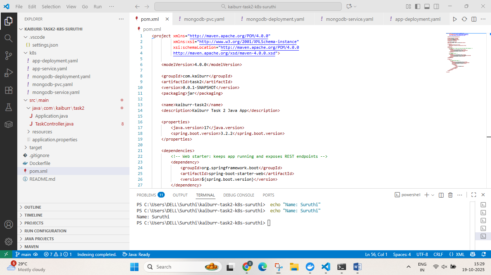

2. **Git Initialization & First Commit**  
   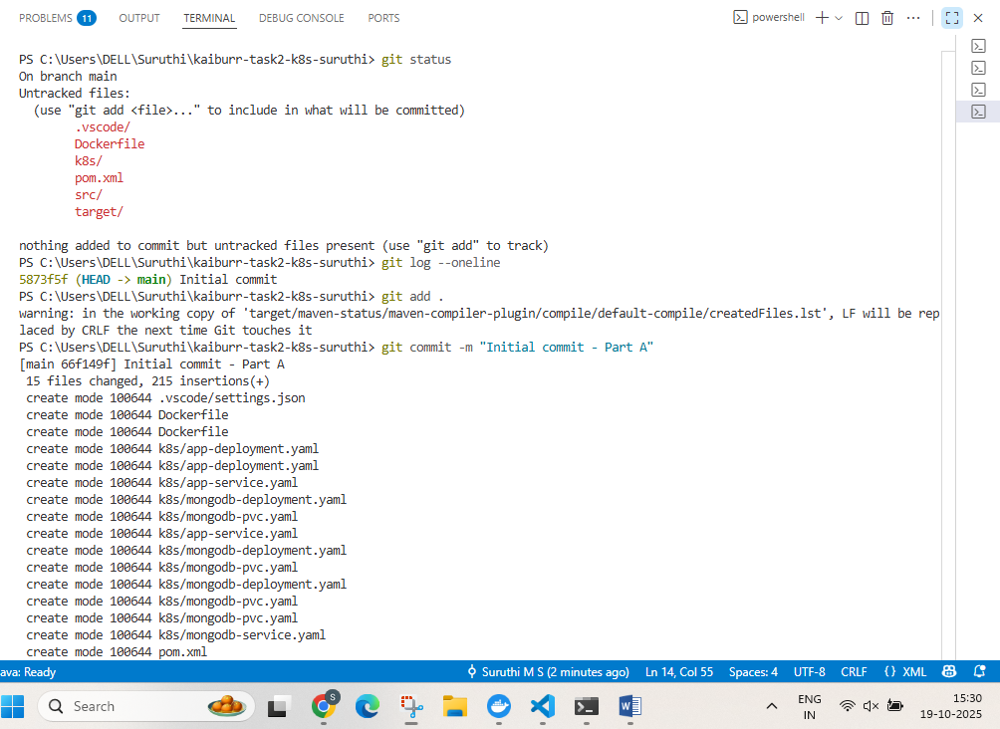

3. **Docker Images List**  
   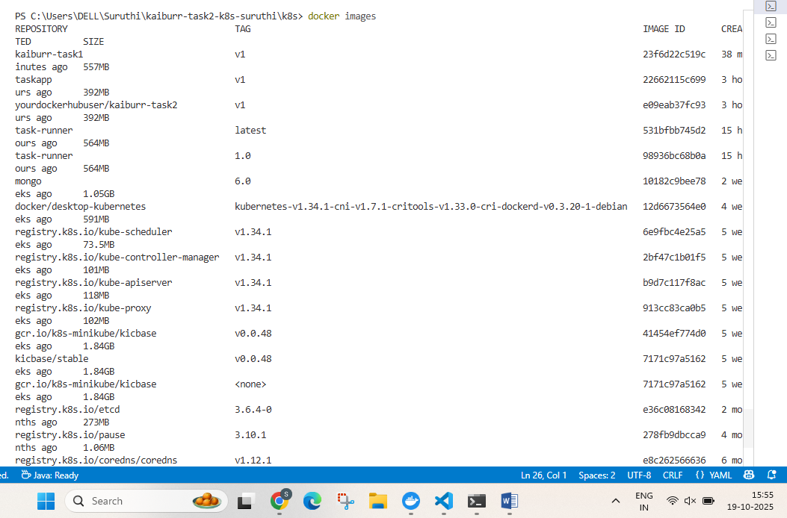

4. **Kubernetes Pods Running (App & MongoDB)**  
   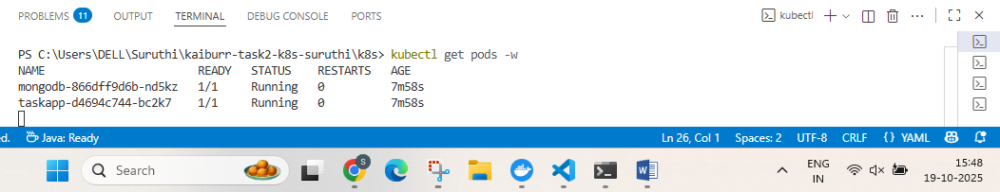

5. **Kubectl Get Pods for MongoDB**  
   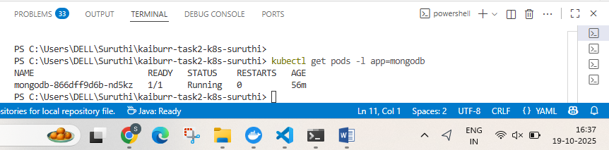

6. **MongoDB Pod Running**  
   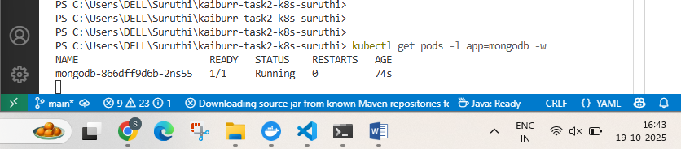

7. **PVC Bound Output**  
   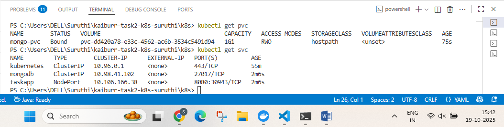

8. **MongoDB Persistence - Before Pod Delete**  
   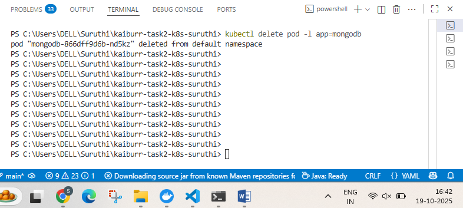

9. **MongoDB Persistence - After Pod Restart**  
   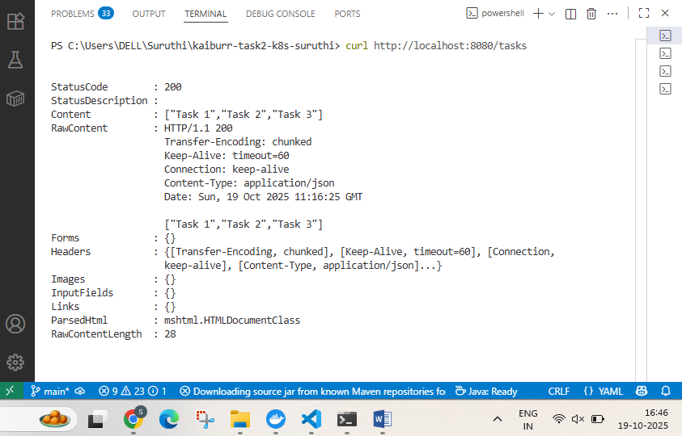

10. **Kubectl Describe App Pod**  
    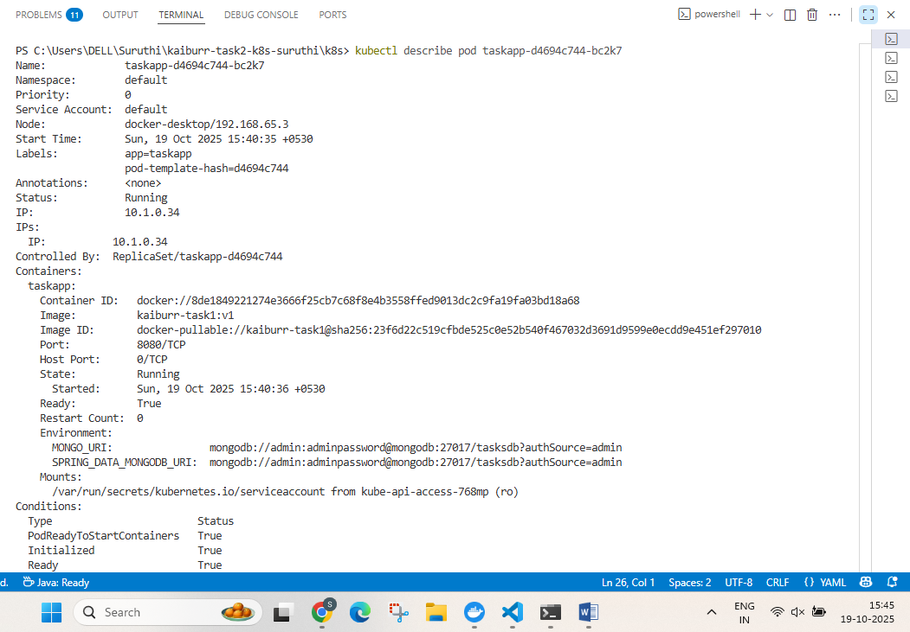

11. **App Service Port Forward**  
    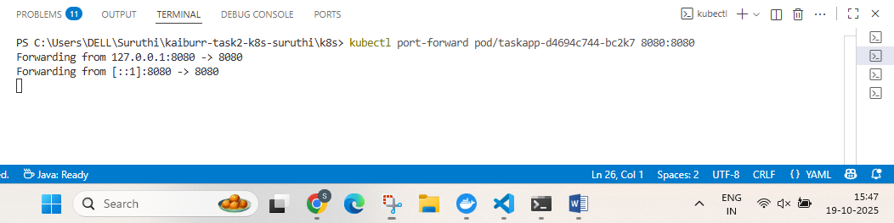

12. **App Access via Host**  
    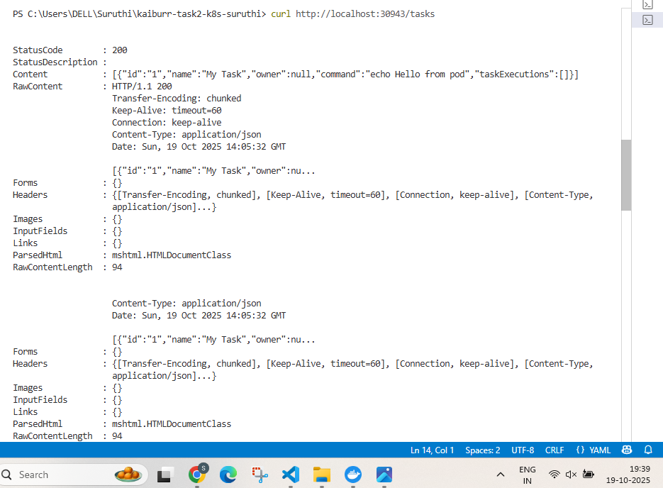

13. **curl GET Endpoint Access**  
    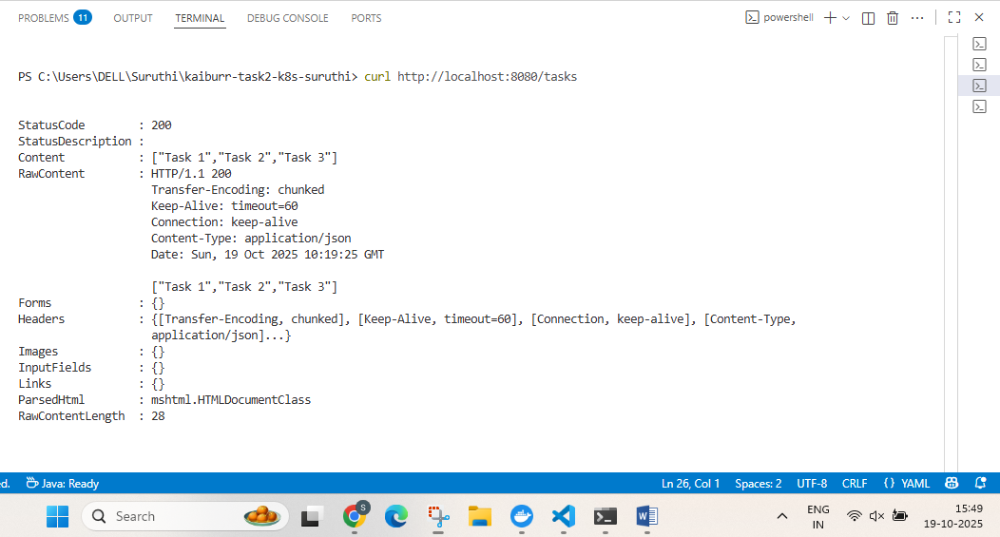

14. **PowerShell GET Tasks**  
    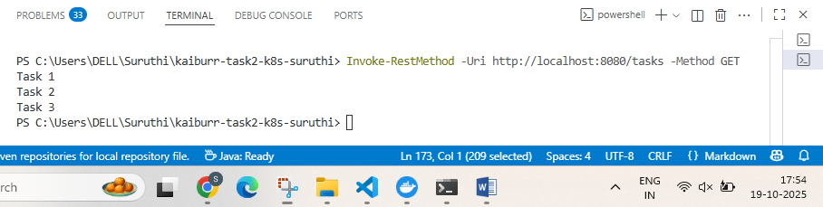

15. **MongoDB Connection Info**  
    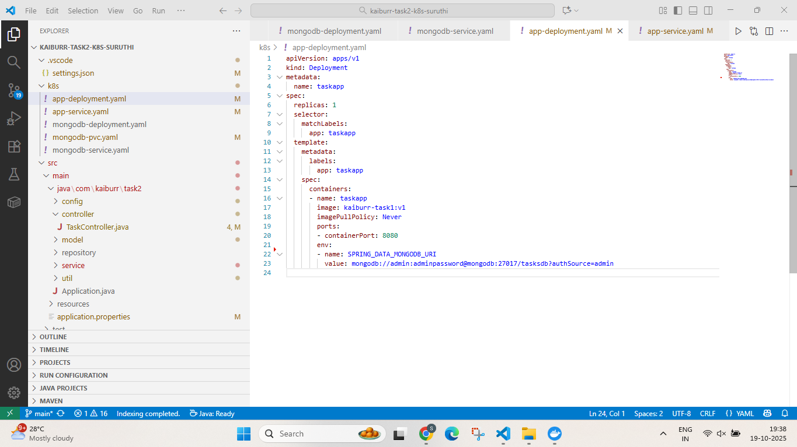

16. **PUT Request Creates New Pod**  
    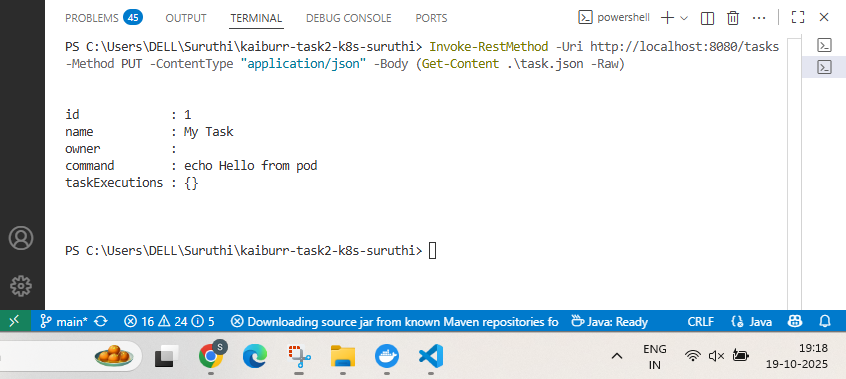

